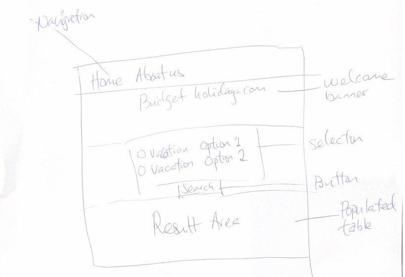
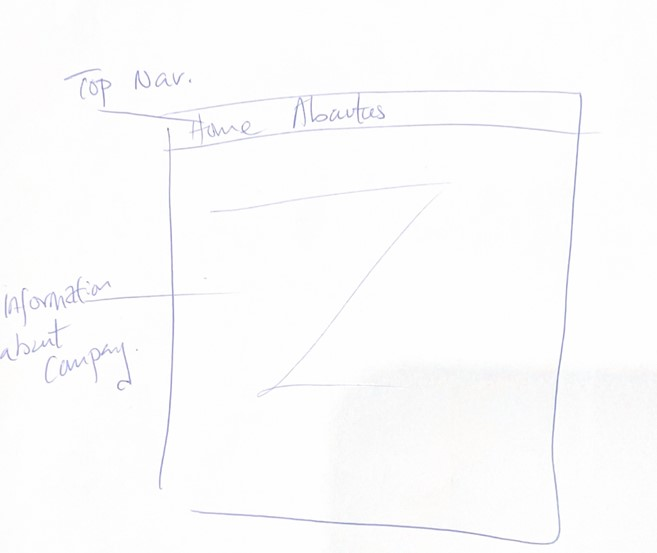
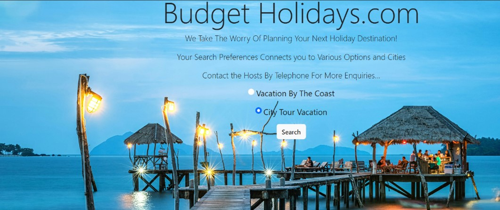
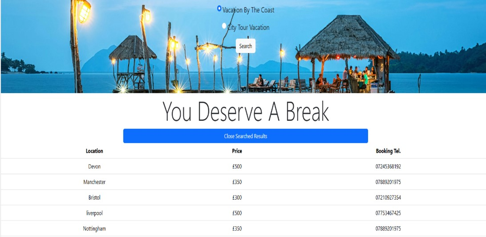
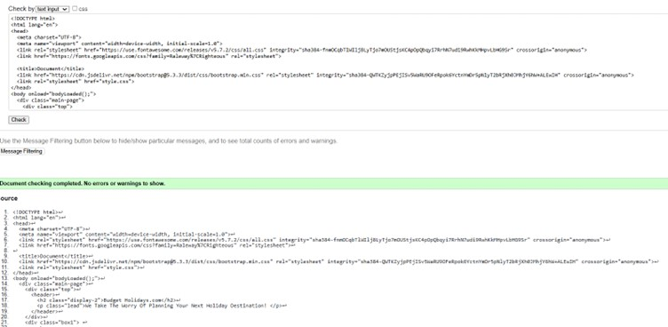
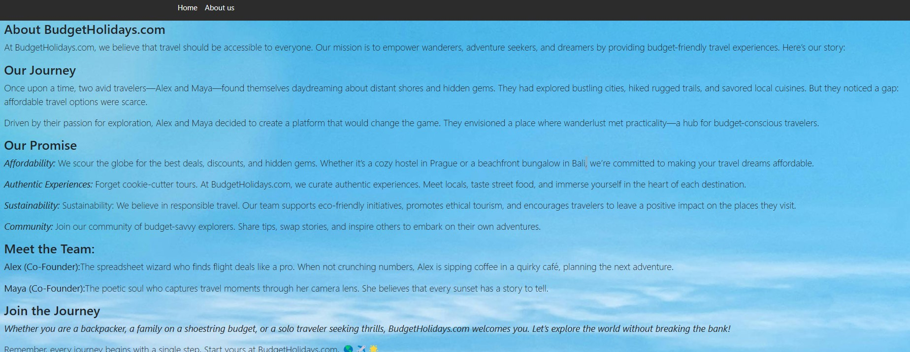
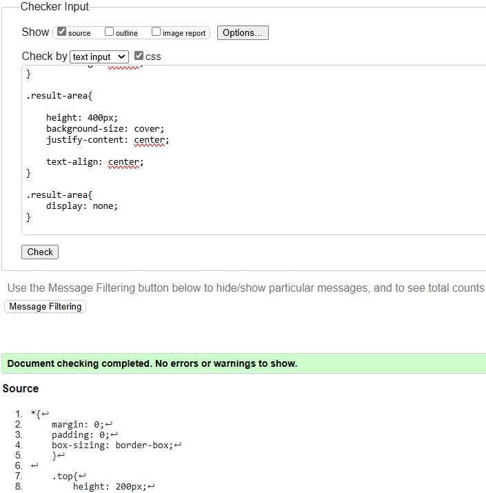
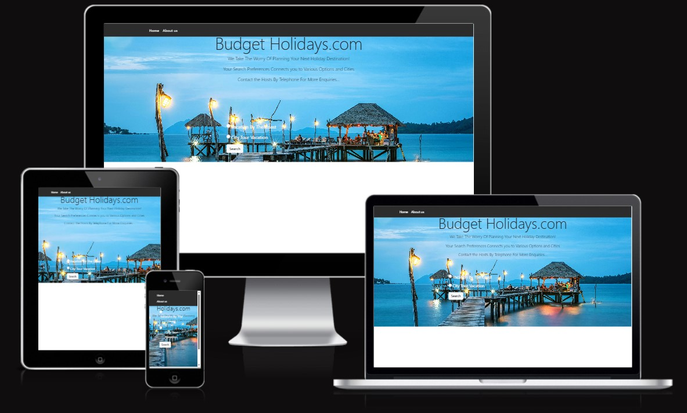
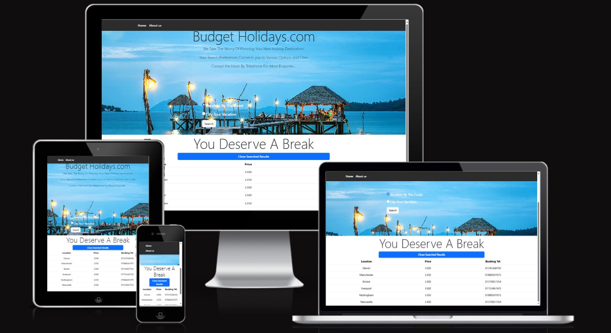
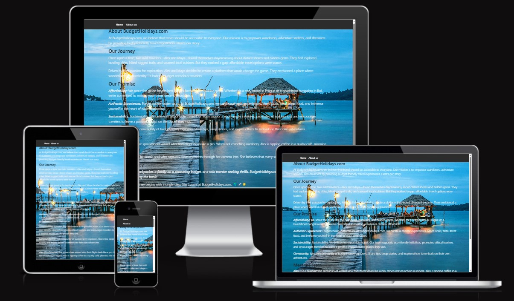

ReadMe 
# Welcome to Budget holidays

## Overview

Budget holidays is a holiday search listings directory app that lets users filter the next holiday destination location by either city or coastal preferences. 

Site vistors  have the chance to choose from a range of locations and holiday type.


## Getting Started

1. **Clone the repository:**
    ```
    git clone https://github.com/Nemi100/tekena-codeinst-project.git

    ```

2. **Navigate to the project directory:**
    ```
    https://nemi100.github.io/tekena-codeinst-project/
    ```

3. **Open the `index.html` file in your preferred web browser.**

## Support

If you have any questions, issues or feedback suggestions regarding Holiday Budget, please feel free to email (teksity@gmail.com)

## User Experience (UX)

This website is a different travel page that is meant to make booking a holiday with or without the family exciting and done with ease. It is also created with the customers in mind, making the choice for holiday destination is made with ease.


**User Stories**

   1.	First Time User Goals
        -	Understand the aim of the website and learn about what sets Budget Holiday.com from the other travel companies’ website.
        -	Navigate around the website with ease, getting understanding of what is the uniqueness of Budget Holiday.com compared to its competitors.
        -	Search for budget holidays in the coast
        -	Search for city tours packages 

2.	Returning User Goals
    - Find out the latest/ newest holiday packages
    - Find the contact information for the selected packages

3.	Frequent User Goals
    -	Review the packages for the coastal holiday on offer
    -	Review the packages for the tour holiday on offer.


## Design

    - Colour Scheme
        - The main colours used are black, light blue, dark blue, grey and white

    - Typography
        - The Roboto is the chosen font to use. This is because its friendly features and open curves, allowing texts to be settled in their natural width, making it the perfect font to use when creating a responsive website.
    
    Imagery
        - The images used are from pixaby at pixel.com

### Wireframes
    
-  Homepage Wireframe

     

- About Us Wireframe

     

### Existing Features

- Navigation bar
 
    1.	Includes links to the homepage and About us pages
    2.	Consistent design across all pages
    3.	Easy navigation between pages without having to revert via the back button
 
    

-	Main Heading
    1.	It has a consistent black background
    2.	Font colour used is white to ensure website is accessible to everyone.
-	Module 1 (Section 1)
    1.	Background image with page contents written in black
    2.	Within the background image there are radio buttons (2 radio button options) that displays the options of holiday packages been offered. It also has the search button that then fetches the selected option.

    
    
-	Module 2 (Section 2)
    1.	In this part of the website, it displays the result of the customer search options in module 1. It also hides the results if no longer needed, keeping the webpage clean, concise and very clear.

    


## Future potential Improvements

Below are some of the future features that could and not limited to be implemented at a later date:

    1.	Shopping cart capability
    2.	Google API to enrich the user experience
    3.	Local news RSS feed
    4.	Weather forecast display with any search results for the selected location.
    5. Social media presence, customers been able to leave feedback and ask questions on any of the social media channel.

 
## Technology Used 

    - Languages Used
        - CSS
        - HTML5
        - JavaScript
    
    Frameworks and Programs Used

        - GitHub
            - This was used to host, share and manage the respository of code files

        - Bootstrap5 framework for mobile first approach
            - This was used in the styling and responsiveness of the web pages 

        - Git
            - This was used to manage and keep track of the code files (version control)

        - VS Code dev tool
            - This was used for the development of the website.

        - Uizard
            - This was used in the creation of the wireframes during the design stage.
        
## Testing

W3C was used to validate all the created pages throughout the development/implementation stages to ensure there were no errors.

 - Markup Validator

    - Home Page 

      

    - About Us

      
        
 - CSS Validator

    - 
        

JSLint was used to test for 
Write JavaScript code, that 
passes through a linter (e.g. 
JSLint) with no major issues and 
write validated HTML and CSS 
code

**Testing User Stories (UX)**

    - First-Time Visitor Goals
        - Navigate easily throughout the site, this has been intentionally done to ensure the user is able to navigate throughout the site. 
        - Understand the main objectives of the site and learn more about the various packages offered by Budget Holidays.
        - Each link has been clearly label with the aim of describing what the page is about.    

    - Returning Visitor / Frequent User Goals
        - Find the newest packages on offer
        - Find the contact information and cost of required city tour/coast holiday packages


**Additional Testing**

    - All created web pages were tested on various browsers (Microsoft Edge, Google Chrome and Safari)
    - All links on the website was tested to ensure accuracy
    - Website was tested and reviewed by family and friends
    - Website responsiveness on different devices
   
**Known Bugs**

    - The colour of the text in the About Us page does not compile with accessibility rules, which means some of the text on that page is not clear enough to be readable

    - Mobile responsiveness is not very fluid and also the text over flows with the radio button for the travel packages search.

 - Home Page
 
 

 
 
 - About Us

  


## Acknowledgements

 - [Awesome Readme Templates](https://awesomeopensource.com/project/elangosundar/awesome-README-templates)
 - [Awesome README](https://github.com/matiassingers/awesome-readme)
 - [How to write a Good readme](https://bulldogjob.com/news/449-how-to-write-a-good-readme-for-your-github-project)
 - [Pexels Images] (https://www.pexels.com/search/concert/)
 - [Code Institute](https://codeinstitute.net/)

 - [8 must known Javascript Array methods] (https://www.youtube.com/watch?v=R8rmfD9Y5-c)

- [JSON response to html table] (https://www.youtube.com/watch?v=XmdOZ5NSqb8&t=121s)

We would like to thank the following individuals and organizations for their contributions to this project:

- [Nemi100](https://github.com/Nemi100)

## Authors

- [@TekenaN](https://github.com/Nemi100)


